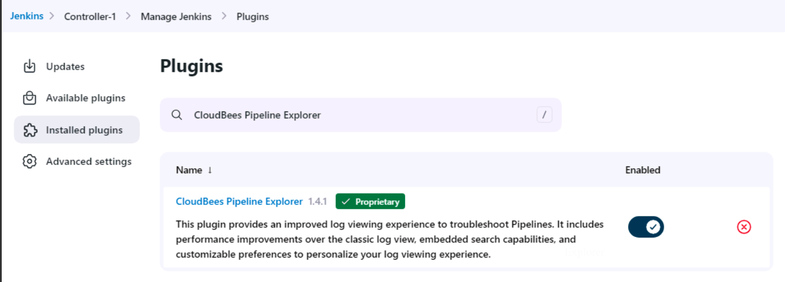

# LAB 3: Enhancing Developer Productivity with CloudBees Pipeline Explorer

In this exercise, you will complete the following tasks:

- Task 1: Verify CloudBees Pipeline Explorer is installed and enabled on one of your Managed Controllers
- Task 2: Search through the build log(s) of a pipeline on one of your Managed Controllers
- Task 3: Troubleshoot errors associated with a pipeline on one of your Managed Controllers
- Task 4 (BONUS): Manage the JUnit test results of a pipeline on one of your Managed Controllers

## Introduction to the CloudBees Pipeine Explorer
The CloudBees Pipeline Explorer plugin offers a streamlined approach to troubleshoot pipelines and view logs. This plugin was developed with a focus on performance to improve your experience for log viewing, whether your log files are 5MB, 500MB, or even up to 5GB.

The Pipeline Explorer can visualize the stages of your Pipelines in a tree view that lets you filter the logs by stages. The log viewport can be customized with user preferences for line numbers, displaying ANSI colors from the log text, word wrapping, and custom time formats for timestamps.

The Pipeline Explorer also provides a search feature, permitted through RBAC, so that users can search large files without leaving the Pipeline Explorer interface.

## Verify CloudBees Pipeline Explorer is Installed and Enabled
To find the plugin, go to **Manage Jenkins > Manage Plugins > Available Plugins** and search for the **"CloudBees Pipeline Explorer"** plugin. The output of your screen should show the following:

> [!IMPORTANT]
> The CloudBees Pipeline Explorer only supports **Pipeline** builds that start after the plugin is installed and enabled. Beginning with CloudBees CI version 2.401.3.3 and higher, the plugin is automatically installed and enabled.

