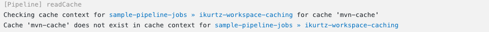
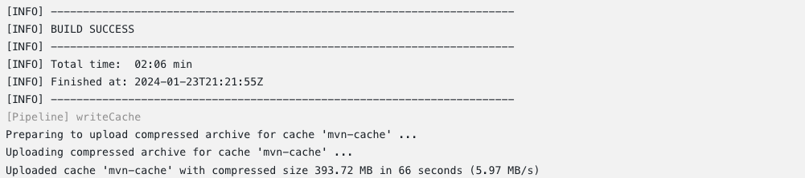
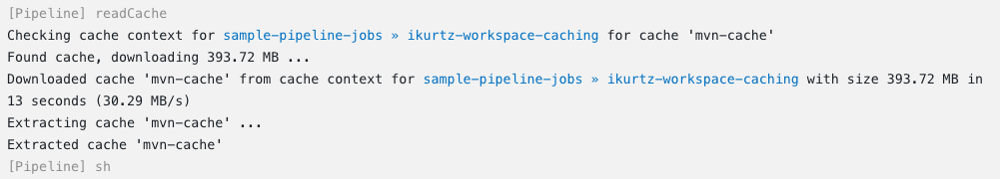
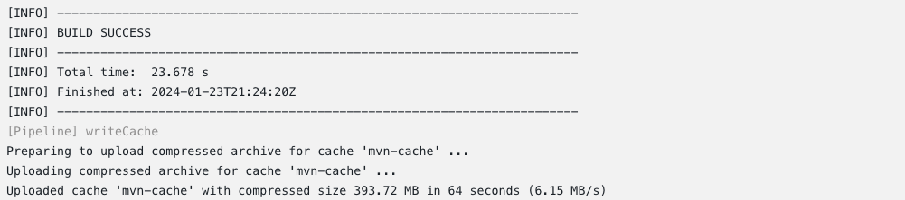

# LAB 2: Increasing Velocity with Workspace Caching for CloudBees CI

In this exercise, you will complete the following tasks:
- Verify that the CloudBees Cache Step Plugin, Artifact Manager on S3 Plugin, and the AWS Global Configuration Plugin have been installed on your Managed Controller.
- Verify that the Workspace Caching configuration has been successfully setup and validated.
    - Verify Artifact Manager on S3 Plugin has been successfully setup
    - Verify the target S3 bucket and its configuration in both CloudBees CI and AWS
- Run a sample Maven CI Pipeline that does not yet take advantage of Workspace Caching and review the build logs in the console output
- Run a sample Maven CI Pipeline that does take advantage of Workspace Caching and review the build logs in the console output
- Identify the differences in total build duration between the two aforementioned builds to learn how Workspace Caching can make a significant difference in improving your business

## Introducing Workspace Caching for CloudBees CI
The [CloudBees Cache Step Plugin](https://docs.cloudbees.com/plugins/ci/cloudbees-cache-step) provides `writeCache` and `readCache` Pipeline steps to use separate storage as caches for workspaces. This is useful for builds running on cloud agents that start with empty caches of build tools, or when builds involve temporary files that take much longer to generate than they take to download.

The [CloudBees S3 Cache Plugin](https://docs.cloudbees.com/plugins/ci/cloudbees-s3-cache) provides a cache implementation for these steps based on [AWS S3](https://aws.amazon.com/s3/).

> [!IMPORTANT]
> Using AWS S3 to store workspace caches will incur additional costs from AWS. Refer to the [AWS documentation](https://aws.amazon.com/s3/pricing/?nc=sn&loc=4) for S3 pricing information.

## Verify Configuration of Workspace Caching
Workspace caching is disabled by default. As an administrator, you can enable this setting on the System configuration page. On `Controller-1`, confirm that workspace caching has been properly configured by first selecting **Manage Jenkins > System**. Navigate to **Workspace Caching** and review the current configuration for the **Cache Implementation**. The **S3 Cache** from the **Cache Manager** list should be selected, as shown in the illustration below.


The S3 cache uses the configuration of the [Artifact Manager on S3 plugin](https://docs.cloudbees.com/plugins/ci/artifact-manager-s3). This plugin permits you to archive artifacts in an S3 Bucket, where there is less need to be concerned about the disk space used by artifacts. We will review the AWS configuration for the S3 bucket we'll be targeting as the cache just after we validate that workspace caching has been enabled for `Controller-1`.

> [!TIP]
> Under **Advanced Options** you can also configure which jobs are able to use the cache with the **Job Include Pattern** and **Job Exclude Pattern** fields.

The **Job Include Pattern** allows you to configure specific jobs that are able to use the configured cache using a comma-separated Ant-style pattern. For example:

- `**` matches all jobs.
- `my-project/**` matches all jobs in the folder `my-project`.
- `*e*` matches all jobs whose name contains the letter **e** that are not in another folder.

This field is empty, which means that all jobs are included by default.

The **Job Exclude Pattern** allows you to exclude an included job. The syntax is the same as the **Job Include Pattern**. However, an empty value means that nothing is excluded that would otherwise be included (for example, if both fields are empty, the workspace caching feature is enabled for all jobs in the CloudBees CI instance).

## Configuring the Artifact Manager for S3
For the CloudBees S3 Cache plugin specifically, the permissions `s3:PutObject`, `s3:GetObject`, `s3:DeleteObject`, and `s3:ListBucket` are needed. For more information on configuring S3, refer to the [Artifact Manager on S3 plugin](https://docs.cloudbees.com/plugins/ci/artifact-manager-s3) documentation. Here is the IAM policy attached to the IAM user we'll be using to connect to Amazon S3:

```
{
    "Version": "2012-10-17",
    "Statement": [
        {
            "Effect": "Allow",
            "Action": [
                "s3:ListBucket",
                "s3:GetBucketLocation"
            ],
            "Resource": "arn:aws:s3:::*"
        },
        {
            "Effect": "Allow",
            "Action": "s3:ListBucket",
            "Resource": "arn:aws:s3:::cb-se-workspace-caching-demo"
        },
        {
            "Effect": "Allow",
            "Action": [
                "s3:PutObject",
                "s3:GetObject",
                "s3:DeleteObject",
                "kms:Encrypt",
                "kms:Decrypt",
                "kms:ReEncrypt*",
                "kms:GenerateDataKey*"
            ],
            "Resource": [
                "arn:aws:s3:::cb-se-workspace-caching-demo/",
                "arn:aws:kms:us-east-1:268150017804:key/73fe2ba6-4124-428d-aaa4-b8e41bd686ff"
            ]
        }
    ]
}
```

Let's take a look at what we need to configure in CloudBees CI to connect to our target AWS S3 bucket for use in workspace caching:

1. Go to **Manage Jenkins > Configure System**.
2. In the **Artifact Management for Builds section**, validate that **Amazon S3** is selected as the Cloud Provider for artifact storage:


3. Navigate to **Manage Jenkins > Amazon Web Services (AWS) Configuration** to validate the name of the target S3 bucket, `cb-se-workspace-caching-demo` and the corresponding AWS IAM credentials needed to connect to it. Let's start by reviewing the bucket configuration:


4. After reviewing the S3 bucket settings, let's validate that we have configured the proper credentials before testing the connection to the `cb-se-workspace-caching-demo` S3 bucket:

>[!NOTE]
> Your AWS account must have the right IAM permissions to access the S3 Bucket, and must be able to `list`, `get`, `put`, and `delete` objects in the S3 Bucket.


5. It's time to validate the connection from `Controller-1` in CloudBees CI to the S3 bucket we have configured. Directly under the S3 bucket settings, click the **Validate S3 Bucket configuration**. As a result, the following message should be returned, indicating we're ready to use our new S3 bucket to cache build artifacts:


6. Upon successful validation, we've completed the configuration for our Artifact Manager on S3.

## Running a Maven CI Pipeline

Before we add the pipeline steps needed to use the S3 cache that we just configured, let's first review the `Jenkinsfile` for the Maven pipeline we'll be using for this lab:

```
pipeline {
    agent none
    options {
        timeout(time: 10, unit: 'MINUTES') 
    }
    stages {
        stage('Build') {
            agent { label 'maven' }
            steps {
                container ('maven') {
                    checkout scmGit(branches: [[name: '*/master']], extensions: [], userRemoteConfigs: [[url: 'https://github.com/jenkinsci/kubernetes-plugin.git']])
                    sh """
                    mvn -Dmaven.repo.local=.m2 -DskipTests=true package
                    """
                }
            }
        }
    }
}
```
In summary, this pipeline will:
1. Check out source code from the `kubernetes-plugin` GitHub repository
2. Build the Maven project within an ephemeral kubernetes agent labeled `maven`
3. Runs the Maven package, skipping certain Tests in the process

We're specifically focused on the `Build` stage of a continuous integration process for a Maven project related to the popular [Kubernetes Plugin](https://docs.cloudbees.com/plugins/ci/kubernetes).

As a developer, each and every time you trigger this pipeline you know it will have to fetch and download alll of the maven dependencies required for the build. This can significantly delay build times, impacting throughput, which will invevitably lead to slower velocity in delivering new and important features or bug fixes to your customer base. With Workspace Caching for CloudBees CI, you're going to take control of your build health and keep velocity high in the sky where it should be.

Before running this Maven pipeline let's add the `writeCache` and `readCache` steps to the `Jenkinsfile` we explored earlier in the lab so we can begin to use the S3 bucket as a cache for our Maven dependencies.

```
pipeline {
    agent none
    options {
        timeout(time: 10, unit: 'MINUTES') 
    }
    stages {
        stage('Build') {
            agent { label 'maven' }
            steps {
                container ('maven') {
                    checkout scmGit(branches: [[name: '*/master']], extensions: [], userRemoteConfigs: [[url: 'https://github.com/jenkinsci/kubernetes-plugin.git']])
                    readCache name: 'mvn-cache'
                    sh """
                    mvn -Dmaven.repo.local=.m2 -DskipTests=true package
                    """
                    writeCache includes: '.m2/**', name: 'mvn-cache'
                }
            }
        }
    }
}
```
In the Maven pipeline shown above, we'll note two operations related to Workspace Caching:
1. `readCache`: This step retrieves the specified cache from storage and restores all files it contains into the current working directory. Files that exist are overwritten. Files that exist but are not part of the cache are left unmodified.
    1. `name`: A mandatory parameter describing the cache. In the provided code snippet, `readCache 'mvn-cache'` has been defined as the name. This is used to identify the cache in builds of the same job
  
2. `writeCache`: This step takes the following parameters to accomplish its tasks:
    1. `name`: Identical to the parameter used for the `readCache` step, we'll use the same `mvn-cache` to write the files to.
    2. `includes`: A **mandatory**, comma-separated list of Ant-style expressions that defines the set of files to include in the cache. This works like the artifacts parameter to the `archiveArtifacts` Pipeline step.
    3. `excludes`: An **optional**, comma-separated list of Ant-style expressions that defines the set of files to exclude from the cache, if they would otherwise be included.
  
In summary, after we checkout the source code from the `kubernetes-plugin` repository the `readCache` step will not take you by surprise since we haven't written anything to `mvn-cache` yet. We will circle back to that. After Maven is done packaging we will then use the `writeCache` step in our pipeline to include all files under the `.m2/` directory when uploading them to `mvn-cache`.

Navigate to the **workspace-caching-jobs** folder on `Controller-1` and then select the **ikurtz-workspace-caching-demo** Pipeline. 
1. Run the Pipeline by clicking **Build Now** and then nagivate to the **Console Output** to follow along with the Build.
2. Right after the `git` checkout step, you'll see the following message appear in the Console Output as the `readCache` step is executed:



3. As mentioned before, since we haven't written any files to the `mvn-cach` in the S3 bucket yet ... it will be empty and this build run will download dependencies from the internet.
4. When the Pipeline finishes, be sure to take note of the Total Build Time:



It's just as important to note the `writeCache` step that's executed to upload the compressed archive to the `mvn-cache` we defined in the Pipeline. You'll see that CloudBees CI successfully uploaded the cache, which we can confirm in the AWS console.

## Running a Maven CI Pipeline Using Workspace Caching
Now that we've successfully written files to the dedicated cache for this Pipeline, let's see just how much we can reduce the Total Build Time on the next run.

1. Navigate back to the **ikurtz-workspace-caching** job from the Console Output.
2. Click **Build Now** again and then navigate to the **Console Output** to follow along with the Build.
3. As expected, when the `readCache` step is executed on this latest Build we can confirm that the `mvn-cache` we just wrote to is found:



4. When the Pipeine finishes, take note of the Total Build Time:



We were able to **significantly** reduce the total time it took for Maven to build the `kubernetes-plugin`, as it's now able to retrieve any dependencies or other artifacts it needs within seconds thanks to Workspace Caching. 

Now what if something went wrong during a specific Pipeline stage? What if you need to easily comb through the build log? In the past, all doors led to the Console Output. In the next lab, we'll showcase CloudBees CI's new troubleshooting experience with **Pipeline Explorer**. 


